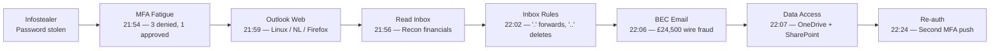

# SOC Incident Investigation: Scattered Spider — BEC Wire Fraud

**Analyst:** Drew Harris\
**Date Completed:** April 2026\
**Environment:** LogN Pacific Financial Services — Finance Department\
**Timeframe:** 25 February 2026, 21:00–23:00 UTC\
**Platform:** Microsoft Sentinel / Log Analytics (`LAW-Cyber-Range`)\
**Tables:** `SigninLogs` · `CloudAppEvents` · `EmailEvents`\
**Source:** Cyber Range, LogN Pacific

---

## Table of Contents

1. [Executive Summary](#executive-summary)
2. [Key Findings](#key-findings)
3. [Quick Reference](#quick-reference)
4. [Attack Timeline](#attack-timeline)
5. [Investigation Walkthrough](#investigation-walkthrough)
6. [Remediation Recommendations](#remediation-recommendations)
7. [MITRE ATT&CK Mapping](#mitre-attck-mapping)
8. [Lessons Learned](#lessons-learned)

---

## Executive Summary

A vendor payment of £24,500 was redirected to an unknown account after an attacker compromised finance employee Mark Smith's (`m.smith@lognpacific.org`) Microsoft 365 account via MFA fatigue. The attacker — operating from `205.147.16.190` (Netherlands) on a Linux machine — bombarded Mark with push notifications until he approved one, authenticated to Outlook Web, created two malicious inbox rules, then sent a fraudulent thread-hijacked invoice email to `j.reynolds@lognpacific.org`. The attacker also accessed OneDrive and SharePoint. No Conditional Access policies evaluated the session. TTPs are consistent with **Scattered Spider** (UNC3944).

---

## Key Findings

- **MFA fatigue:** 3 denied pushes → 1 approval → full account access; second MFA push at 22:24 suggests session token expiry
- **Anomaly stack:** NL (not US), Linux (not Windows), Firefox (not corporate browser), unmanaged device, off-hours
- **Two inbox rules:** `.` forwards financial emails to `insights@duck.com`; `..` auto-deletes security alerts
- **BEC fraud:** `RE: Invoice #INV-2026-0892 - Updated Banking Details` sent internally to `j.reynolds@lognpacific.org`
- **Data access beyond email:** 20+ OneDrive structural modifications and SharePoint page views — attacker was actively exploring, not just reading
- **No Conditional Access:** `ConditionalAccessStatus: notApplied` — the single biggest defensive failure
- **Single session:** `00225cfa-a0ff-fb46-a079-5d152fcdf72a` ties all 73 events across all three tables
- **Attribution:** Scattered Spider — credentials likely sourced from infostealer malware logs

---

## Quick Reference

| # | Finding | Answer |
|---|---------|--------|
| 01 | Workspace | `LAW-Cyber-Range` |
| 02 | Compromised Account | `m.smith@lognpacific.org` |
| 03 | Attacker IP | `205.147.16.190` |
| 04 | Geolocation | `NL` |
| 05 | MFA Failure Code | `50074` |
| 06 | MFA Denials | `3` |
| 07 | Target App | `One Outlook Web` |
| 08 | Attacker OS | `Linux` |
| 09 | Attacker Browser | `Firefox 147.0` |
| 10 | First Post-Auth Action | `MailItemsAccessed` |
| 11 | Persistence ActionType | `New-InboxRule` |
| 12 | Rule 1 Name | `.` |
| 13 | Forwarding Address | `insights@duck.com` |
| 14 | Forwarding Keywords | `invoice, payment, wire, transfer` |
| 15 | Priority Parameter | `StopProcessingRules` |
| 16 | Rule 2 Name | `..` |
| 17 | Deletion Keywords | `suspicious, security, phishing, unusual, compromised, verify` |
| 18 | Fraud Recipient | `j.reynolds@lognpacific.org` |
| 19 | Email Subject | `RE: Invoice #INV-2026-0892 - Updated Banking Details` |
| 20 | Email Direction | `Intra-org` |
| 21 | Sender IP Match | `205.147.16.190` |
| 22 | File Access App | `Microsoft OneDrive for Business` |
| 23 | Additional App | `Microsoft SharePoint Online` |
| 24 | Session ID | `00225cfa-a0ff-fb46-a079-5d152fcdf72a` |
| 25 | Conditional Access | `notApplied` |
| 26 | MITRE: MFA Fatigue | `T1621` |
| 27 | MITRE: Email Rules | `T1564.008` |
| 28 | Credential Source | `Infostealer` |
| 29 | First Containment | `Revoke Sessions` |
| 30 | Threat Group | `Scattered Spider` |

---

## Attack Timeline

The following timeline was generated by a cross-table union query correlating all attacker activity from `SigninLogs`, `CloudAppEvents`, and `EmailEvents` into a single chronological view using the attacker's IP `205.147.16.190` as the pivot:

```kql
SigninLogs
| where TimeGenerated between (datetime(2026-02-25T21:00:00Z) .. datetime(2026-02-25T23:00:00Z))
| where IPAddress == "205.147.16.190"
| extend Source = "SigninLogs", Activity = strcat(ResultType, " - ", AppDisplayName)
| project TimeGenerated, Source, Activity, IPAddress
| union (
    CloudAppEvents
    | where TimeGenerated between (datetime(2026-02-24T21:00:00Z) .. datetime(2026-02-25T23:00:00Z))
    | where IPAddress == "205.147.16.190"
    | extend RuleName = tostring(RawEventData.Parameters[3].Value)
    | extend Source = "CloudAppEvents",
        Activity = iif(ActionType == "New-InboxRule",
            strcat(ActionType, " [", RuleName, "] - ", Application),
            strcat(ActionType, " - ", Application))
    | project TimeGenerated, Source, Activity, IPAddress
)
| union (
    EmailEvents
    | where TimeGenerated between (datetime(2026-02-23T21:00:00Z) .. datetime(2026-02-25T23:00:00Z))
    | where SenderIPv4 == "205.147.16.190"
    | extend Source = "EmailEvents", Activity = strcat("Email to ", RecipientEmailAddress, " - ", Subject)
    | project TimeGenerated, Source, Activity, IPAddress = SenderIPv4
)
| sort by TimeGenerated asc
```

**73 events returned.** Key events extracted below (full export: `query_data.csv`):

| Time (UTC) | Source | Activity | Kill Chain Phase |
|---|---|---|---|
| 21:54:24 | SigninLogs | `50074 - One Outlook Web` | MFA Fatigue |
| 21:56:24 | CloudAppEvents | `MailItemsAccessed - Microsoft Exchange Online` | Reconnaissance |
| 21:57:53 | CloudAppEvents | `MailItemsAccessed - Microsoft Exchange Online` | Reconnaissance |
| 21:59:52 | SigninLogs | `0 - One Outlook Web` | Auth Success |
| 22:02:33 | CloudAppEvents | `New-InboxRule [.] - Microsoft Exchange Online` | Persistence |
| 22:03:59 | CloudAppEvents | `New-InboxRule [..] - Microsoft Exchange Online` | Persistence |
| 22:04:34 | CloudAppEvents | `Create - Microsoft Exchange Online` | BEC Preparation |
| 22:06:34 | CloudAppEvents | `Send - Microsoft Exchange Online` | BEC Execution |
| 22:06:39 | EmailEvents | `Email to j.reynolds@lognpacific.org - RE: Invoice #INV-2026-0892` | BEC Delivery |
| 22:07:16 | CloudAppEvents | `SignInEvent - Microsoft SharePoint Online` | Data Access |
| 22:07:16 | CloudAppEvents | `FileAccessed - Microsoft OneDrive for Business` | Data Access |
| 22:07:46 | CloudAppEvents | `PageViewed - Microsoft SharePoint Online` | Data Access |
| 22:09:17 | SigninLogs | `0 - Office 365 SharePoint Online` | Data Access |
| 22:10:10 | CloudAppEvents | `PageViewed - Microsoft OneDrive for Business` | Data Access |
| 22:10:33 | SigninLogs | `0 - OfficeHome` | Portal Access |
| 22:24:32 | SigninLogs | `50074 - One Outlook Web` | Second MFA Fatigue |
| 22:25:37 | SigninLogs | `0 - One Outlook Web` | Re-authentication |

**Notable observation from full telemetry:** A second MFA fatigue push occurred at 22:24:32 — the attacker's session token may have expired, requiring re-authentication. Between 22:07:16 and 22:07:42, a burst of 20+ OneDrive events (`ListCreated`, `ListColumnCreated`, `Broke sharing inheritance`) indicates the attacker was actively exploring or modifying Mark's OneDrive structure, not just viewing files.



---

## Investigation Walkthrough

### Phase 1: Confirm Compromise & Identify Attacker

```kql
SigninLogs
| where TimeGenerated between (datetime(2026-02-25T21:00:00Z) .. datetime(2026-02-25T23:00:00Z))
| where UserDisplayName contains "Mark"
| project TimeGenerated, UserDisplayName, UserPrincipalName, ResultType, IPAddress, AppDisplayName, Location
```

Two IPs for one account: `172.175.65.103` (US, legitimate) and `205.147.16.190` (NL, attacker). Counting `ResultType == 50074` returned **3** denied MFA pushes before Mark approved the 4th. Device profile from `DeviceDetail` JSON: **Linux**, **Firefox 147.0**, `isManaged: false`, `isCompliant: false`.

---

### Phase 2: Post-Auth Activity & Persistence

```kql
CloudAppEvents
| where TimeGenerated between (datetime(2026-02-24T21:00:00Z) .. datetime(2026-02-25T23:00:00Z))
| where IPAddress contains "205.147.16.190"
| where ActionType == "New-InboxRule"
| sort by TimeGenerated asc
| mv-expand Params = RawEventData.Parameters
| project TimeGenerated, ActionType, ParamName = tostring(Params.Name), ParamValue = tostring(Params.Value)
```

**Rule `.`** (22:02:33) — `ForwardTo: insights@duck.com`, keywords: `invoice, payment, wire, transfer`, `StopProcessingRules: True`\
**Rule `..`** (22:03:59) — `DeleteMessage: True`, keywords: `suspicious, security, phishing, unusual, compromised, verify`

---

### Phase 3: BEC Execution

```kql
EmailEvents
| where TimeGenerated between (datetime(2026-02-23T21:00:00Z) .. datetime(2026-02-25T23:00:00Z))
| where SenderIPv4 contains "205.147.16.190"
| project TimeGenerated, SenderFromAddress, RecipientEmailAddress, Subject, EmailDirection, SenderIPv4
```

At 22:06:39, fraudulent email sent to `j.reynolds@lognpacific.org`. Subject: `RE: Invoice #INV-2026-0892 - Updated Banking Details`. Direction: `Intra-org`. `SenderIPv4` matches the attacker's session IP.

---

### Phase 4: Scope & Correlation

Session ID `00225cfa-a0ff-fb46-a079-5d152fcdf72a` confirmed matching across `SigninLogs.SessionId` and `CloudAppEvents.RawEventData.AppAccessContext.AADSessionId`. The attacker accessed **OneDrive for Business** (file access + 20+ structural modifications), **SharePoint Online** (page views), and **OfficeHome** portal. `ConditionalAccessStatus: notApplied` — a managed device policy would have blocked everything.

---

## Remediation Recommendations

**Immediate:** Revoke sessions, remove inbox rules (`.` and `..`), block `205.147.16.190`, block forwarding to `insights@duck.com`, reset credentials, audit j.reynolds for actions on the fraudulent invoice.

**Conditional Access:** Require managed/compliant devices. Location-based policies for unexpected geographies. Migrate to phishing-resistant MFA (FIDO2). If push remains, enable number matching.

**Email Security:** Disable external auto-forwarding via transport rules. Alert on `New-InboxRule` with external `ForwardTo` or `DeleteMessage: True`. Out-of-band verification for payment detail changes.

**Detection Rules:** Alert on 3+ `ResultType 50074` within 10 minutes per user. Alert on auth from unmanaged devices with `notApplied`. Monitor inbox rule creation with financial or security keywords.

---

## MITRE ATT&CK Mapping

| Tactic | ID | Technique | Confidence |
|---|---|---|---|
| Credential Access | T1621 | MFA Request Generation | 🔴 High |
| Initial Access | T1078 | Valid Accounts | 🔴 High |
| Collection | T1114.002 | Email Collection: Remote Email Collection | 🔴 High |
| Persistence | T1137.005 | Office Application Startup: Outlook Rules | 🔴 High |
| Defense Evasion | T1564.008 | Hide Artifacts: Email Hiding Rules | 🔴 High |
| Lateral Movement | T1534 | Internal Spearphishing | 🔴 High |
| Impact | T1657 | Financial Theft | 🔴 High |
| Collection | T1213.002 | Data from Information Repositories: SharePoint | 🟠 Medium |

---

## Lessons Learned

Dynamic JSON columns (`DeviceDetail`, `RawEventData`) require `tostring()` for comparisons and `mv-expand` for arrays. Application names differ across tables (`Microsoft SharePoint Online` vs `Office 365 SharePoint Online`) — use `has` with partial keywords when correlating cross-table.

The anomaly stacking concept — country, OS, browser, device compliance, time — is how cloud identity compromise becomes detectable. No single indicator is conclusive, but five deviations in one session is confirmed compromise. The `ConditionalAccessStatus: notApplied` finding was the most impactful: the platform could have blocked this attack, but no policy was configured.

---

## Appendix: Full Flag & Query Reference

### Q01 — Workspace Name
**Answer:** `LAW-Cyber-Range`

---

### Q02 — Compromised Account
**Answer:** `m.smith@lognpacific.org`
```kql
SigninLogs
| where TimeGenerated between (datetime(2026-02-25T21:00:00Z) .. datetime(2026-02-25T23:00:00Z))
| where UserDisplayName contains "Mark"
| project TimeGenerated, UserDisplayName, UserPrincipalName, ResultType, IPAddress, AppDisplayName
```

---

### Q03 — Attacker IP
**Answer:** `205.147.16.190`
```kql
SigninLogs
| where TimeGenerated between (datetime(2026-02-24T21:00:00Z) .. datetime(2026-02-25T23:00:00Z))
| where UserDisplayName contains "Mark"
| project TimeGenerated, UserDisplayName, UserPrincipalName, ResultType, IPAddress, AppDisplayName, Location
```

---

### Q04 — Attacker Geolocation
**Answer:** `NL`

Same query as Q03 — the `Location` field contains the country code.

---

### Q05 — MFA Failure Code
**Answer:** `50074`
```kql
SigninLogs
| where TimeGenerated between (datetime(2026-02-24T21:00:00Z) .. datetime(2026-02-25T23:00:00Z))
| where UserDisplayName contains "Mark"
| where ResultType != 50140
| project TimeGenerated, UserDisplayName, UserPrincipalName, ResultType, IPAddress, AppDisplayName
```

---

### Q06 — MFA Denials Before Approval
**Answer:** `3`
```kql
SigninLogs
| where TimeGenerated between (datetime(2026-02-24T21:00:00Z) .. datetime(2026-02-25T23:00:00Z))
| where UserDisplayName contains "Mark"
| where ResultType == 50074
| count
```

---

### Q07 — Target Application
**Answer:** `One Outlook Web`
```kql
SigninLogs
| where TimeGenerated between (datetime(2026-02-24T21:00:00Z) .. datetime(2026-02-25T23:00:00Z))
| where IPAddress contains "205.147.16.190"
| project TimeGenerated, AppDisplayName, UserDisplayName, ResultSignature
```

---

### Q08 — Attacker OS
**Answer:** `Linux`
```kql
SigninLogs
| where TimeGenerated between (datetime(2026-02-24T21:00:00Z) .. datetime(2026-02-25T23:00:00Z))
| where IPAddress contains "205.147.16.190"
| extend OS = tostring(DeviceDetail.operatingSystem)
| project TimeGenerated, AppDisplayName, UserDisplayName, OS
```

---

### Q09 — Attacker Browser
**Answer:** `Firefox 147.0`
```kql
SigninLogs
| where TimeGenerated between (datetime(2026-02-24T21:00:00Z) .. datetime(2026-02-25T23:00:00Z))
| where IPAddress contains "205.147.16.190"
| extend Browser = tostring(DeviceDetail.browser)
| project TimeGenerated, AppDisplayName, UserDisplayName, Browser
```

---

### Q10 — First Post-Auth ActionType
**Answer:** `MailItemsAccessed`
```kql
CloudAppEvents
| where TimeGenerated between (datetime(2026-02-24T21:00:00Z) .. datetime(2026-02-25T23:00:00Z))
| where IPAddress contains "205.147.16.190"
| sort by TimeGenerated asc
| project TimeGenerated, IPAddress, ActionType, AccountDisplayName
```

---

### Q11 — Inbox Rule ActionType
**Answer:** `New-InboxRule`

Same query as Q10 — `New-InboxRule` appears in the `ActionType` column after the `MailItemsAccessed` events.

---

### Q12 — First Rule Name
**Answer:** `.`
```kql
CloudAppEvents
| where TimeGenerated between (datetime(2026-02-24T21:00:00Z) .. datetime(2026-02-25T23:00:00Z))
| where IPAddress contains "205.147.16.190"
| where ActionType == "New-InboxRule"
| sort by TimeGenerated asc
| mv-expand Params = RawEventData.Parameters
| where tostring(Params.Name) == "Name"
| project TimeGenerated, ActionType, RuleName = tostring(Params.Value)
```

---

### Q13 — Forwarding Address
**Answer:** `insights@duck.com`
```kql
CloudAppEvents
| where TimeGenerated between (datetime(2026-02-24T21:00:00Z) .. datetime(2026-02-25T23:00:00Z))
| where IPAddress contains "205.147.16.190"
| where ActionType == "New-InboxRule"
| sort by TimeGenerated asc
| mv-expand Params = RawEventData.Parameters
| project TimeGenerated, ActionType, ParamName = tostring(Params.Name), ParamValue = tostring(Params.Value)
```

---

### Q14 — Forwarding Keywords
**Answer:** `invoice, payment, wire, transfer`

Same query as Q13 — look for the row where `ParamName == "SubjectOrBodyContainsWords"`.

---

### Q15 — Rule Priority Parameter
**Answer:** `StopProcessingRules`

Same query as Q13 — the `StopProcessingRules: True` parameter ensures no other rules process matched emails.

---

### Q16 — Second Rule Name
**Answer:** `..`

Same query as Q12 — second row in the results (later timestamp).

---

### Q17 — Deletion Keywords
**Answer:** `suspicious, security, phishing, unusual, compromised, verify`

Same query as Q13 — filter to the second `New-InboxRule` event and look for `SubjectOrBodyContainsWords`.

---

### Q18 — Fraud Recipient
**Answer:** `j.reynolds@lognpacific.org`
```kql
EmailEvents
| where TimeGenerated between (datetime(2026-02-23T21:00:00Z) .. datetime(2026-02-25T23:00:00Z))
| where SenderIPv4 contains "205.147.16.190"
| project TimeGenerated, SenderFromAddress, RecipientEmailAddress, Subject, EmailDirection, SenderIPv4
```

---

### Q19 — Email Subject Line
**Answer:** `RE: Invoice #INV-2026-0892 - Updated Banking Details`

Same query as Q18 — the `Subject` field contains the full subject line.

---

### Q20 — Email Direction
**Answer:** `Intra-org`

Same query as Q18 — the `EmailDirection` field confirms internal delivery.

---

### Q21 — Sender IP Correlation
**Answer:** `205.147.16.190`

Same query as Q18 — `SenderIPv4` matches the attacker's sign-in IP from Q03.

---

### Q22 — File Access Application
**Answer:** `Microsoft OneDrive for Business`
```kql
CloudAppEvents
| where TimeGenerated between (datetime(2026-02-24T21:00:00Z) .. datetime(2026-02-25T23:00:00Z))
| where IPAddress contains "205.147.16.190"
| where ActionType == "FileAccessed"
| project TimeGenerated, AccountDisplayName, IPAddress, ActionType, Application
```

---

### Q23 — Additional Application
**Answer:** `Microsoft SharePoint Online`
```kql
CloudAppEvents
| where TimeGenerated between (datetime(2026-02-24T21:00:00Z) .. datetime(2026-02-25T23:00:00Z))
| where IPAddress contains "205.147.16.190"
| distinct Application
```

---

### Q24 — Session ID
**Answer:** `00225cfa-a0ff-fb46-a079-5d152fcdf72a`
```kql
CloudAppEvents
| where TimeGenerated between (datetime(2026-02-24T21:00:00Z) .. datetime(2026-02-25T23:00:00Z))
| where IPAddress contains "205.147.16.190"
| where ActionType contains "Rule"
| project TimeGenerated, AccountDisplayName, IPAddress, ActionType, Application,
    SessionId = tostring(RawEventData.AppAccessContext.AADSessionId)
```
```kql
SigninLogs
| where TimeGenerated between (datetime(2026-02-24T21:00:00Z) .. datetime(2026-02-25T23:00:00Z))
| where IPAddress contains "205.147.16.190"
| where ResultType == 0
| project TimeGenerated, UserDisplayName, IPAddress, ResultType, AppDisplayName, SessionId
```

---

### Q25 — Conditional Access Status
**Answer:** `notApplied`
```kql
SigninLogs
| where TimeGenerated between (datetime(2026-02-24T21:00:00Z) .. datetime(2026-02-25T23:00:00Z))
| where IPAddress contains "205.147.16.190"
| where ResultType == 0
| project TimeGenerated, UserDisplayName, IPAddress, ResultType, AppDisplayName, SessionId, ConditionalAccessStatus
```

---

### Q26 — MITRE: MFA Fatigue Technique
**Answer:** `T1621` — MFA Request Generation

---

### Q27 — MITRE: Email Hiding Rules Technique
**Answer:** `T1564.008` — Hide Artifacts: Email Hiding Rules

---

### Q28 — Credential Source Malware
**Answer:** `Infostealer`

---

### Q29 — First Containment Action
**Answer:** `Revoke Sessions`

---

### Q30 — Threat Group Attribution
**Answer:** `Scattered Spider`

---

*Thanks to LogN Pacific and Josh Madakor for the scenario design and Cyber Range environment.*

*This report is based on a controlled Cyber Range scenario. All systems, users, IP addresses, and email addresses are simulated.*
